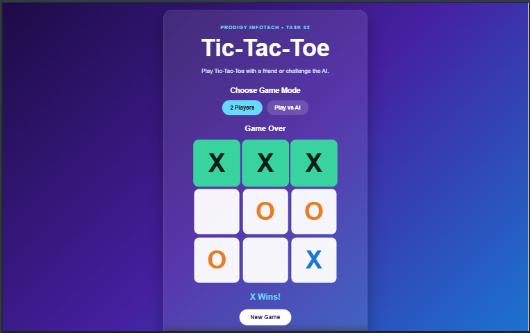
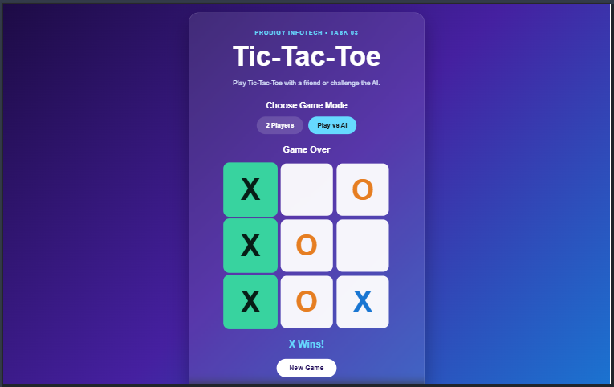
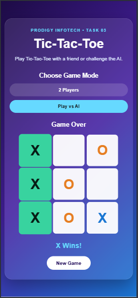

# PRODIGY_WD_03

# Tic-Tac-Toe Web Application

A responsive and interactive Tic-Tac-Toe web application developed as Task 03 of my Web Development Internship at Prodigy InfoTech.

The application allows users to play Tic-Tac-Toe in two different modes: **2 Players** and **Play vs AI**.

## Features

- Responsive 3 × 3 Tic-Tac-Toe game board
- 2 Players game mode
- Player vs AI game mode
- Automatic turn switching
- AI opponent
- Winner detection
- Draw detection
- Winning cells highlighted
- New Game button
- Interactive hover effects
- Responsive design for mobile, tablet and desktop devices
- Simple and user-friendly interface

## Game Modes

### 2 Players

Two players can play against each other on the same device.

- Player X starts the game.
- Players take turns placing their marks.
- The first player to get three marks in a row wins.
- The game ends in a draw if all cells are filled without a winner.

### Play vs AI

The player can play against an AI opponent.

- The player plays as X.
- The AI plays as O.
- The AI attempts to make strategic moves by winning, blocking the player's winning move, taking the center or selecting an available cell.

## Technologies Used

- HTML5
- CSS3
- JavaScript

## How to Play

1. Open the Tic-Tac-Toe web application.
2. Select either **2 Players** or **Play vs AI**.
3. Player X starts the game.
4. Click on any empty cell to place your mark.
5. Players take turns placing their marks.
6. Get three identical marks in a row horizontally, vertically or diagonally to win.
7. If all nine cells are filled without a winner, the game ends in a draw.
8. Click the **New Game** button to start a new game.

## Winning Conditions

A player wins by placing three identical marks in any of the following ways:

### Horizontal

<table>
<tr>
<td align="center">X</td>
<td align="center">X</td>
<td align="center">X</td>
</tr>
<tr>
<td></td>
<td></td>
<td></td>
</tr>
<tr>
<td></td>
<td></td>
<td></td>
</tr>
</table>

### Vertical

<table>
<tr>
<td align="center">X</td>
<td></td>
<td></td>
</tr>
<tr>
<td align="center">X</td>
<td></td>
<td></td>
</tr>
<tr>
<td align="center">X</td>
<td></td>
<td></td>
</tr>
</table>

### Diagonal

<table>
<tr>
<td align="center">X</td>
<td></td>
<td></td>
</tr>
<tr>
<td></td>
<td align="center">X</td>
<td></td>
</tr>
<tr>
<td></td>
<td></td>
<td align="center">X</td>
</tr>
</table>

## Screenshots

### 1. Two Players Mode



### 2. Play vs AI Mode



### 3. Mobile Responsive View



## Live Demo

[Play Tic-Tac-Toe](https://ritika0117.github.io/PRODIGY_WD_03/)

## Project Structure

```text
PRODIGY_WD_03/
│
├── index.html
├── style.css
├── script.js
├── README.md
│
├── screenshot-1-two-players.png
├── screenshot-2-ai-mode.png
├── screenshot-3-winner.png
└── screenshot-4-mobile.png